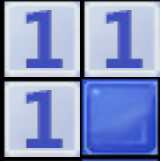
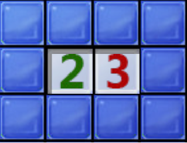

# Mines

## Краткое руководство 
Входные данные. Для инициализации виртуального поля требуется создать и заполнить файл по следующим правилам:
- На первой строчке пишем два числа через пробел: ширину и высоту поля.
- Следующая строчка уже является разметкой поля, а значит на место той ячейки, где есть мина, ставится `!`, на место неоткрытой ячейки - `?`, а туда, где должна быть подсказка - ячейка с числом мин вокруг, ставим соответствующее натуральное число. Также в игре существуют пустые ячейки, не несущие вообще никакой смысловой нагрузки, коих довольно много на низком уровне сложности игры. Они обозначаются нулем.  

Получится что-то вроде этого  
  3 3  
  ???  
  02!  
  ???  
Также необходимо указать выходной файл, в котором будет отображен результат работы программы. Формат выходных данных тоже достаочно прост: друг под другом будут записаны координаты неоткрытых ячеек и соответсвтвующие им вероятности. 

### Запуск программы 
Программа принимает 3 аргумента: файл с входными данными, потом файл, куда будет записан результат работы программы, а так же последний файл с тестовыми данными, необходимый для проверки правильности выполнения работы.  
Пример компиляции: ``Mines.exe Test/InVarTest/1.dat 1.ans Test/OutVarTest/1.tst``  

## Тесты  
В тестовый файл надо записать список ячеек с вероятностями с точностью до 2 знаков после запятой, пример:  
  0 0 0.5  
  0 1 0  
  0 2 0.5  
  1 0 0.81  
Входные файлы лежат `Test/InVarTest`, выходные - в `Test/OutVarTest`  
Для теста основного алгоритма я сделал 5 тестов:  
  
1)Входной файл пуст. Соотвественно, и выходной тоже.  
2)Просто стандартная работа алгоритма без открытых мин. Ответ - список ячеек с ненулевыми вероятностями.  
3)То же самое, что и во втором, но с открытыми минами. Ответ - список ячеек с вероятностями, у некоторых может быть и нулевая.  
4)Нет ни одной ячейки-подсказки. Ответ - у всех неоткрытых ячеек нулевая вероятность.  
5)Нет ни одной неоткрытой ячейки.  Ответ схож с первым тестом.   
bad_field.dat - введенные ячейки конфликтуют друг с другом, ответ дать невозможно. Программа выведет на экран `Bad field`, а выходной файл будет пустым. Проверка на это выполняется в функции `FillVar`: если модуль разности суммарной вероятности группы и число в образующей группу ячейке-подсказке больше, чем 1, то поле забракуется.     
no_wid_or_hei.dat - во входном файле отсутствует высота и(или) ширина. Программа выведет на экран `No width or height`. Выходной файл будет пустым.  
too_small_field.dat - поле введено не до конца, выходной файл будет пустым. Программа выведет на экран `Too small field`.  
unknown_symbol.dat - во входном файле присутствует символ, который нельзя отнести ни к одному типу ячеек. Программа выведет `Unknown symbol`, выходной файл будет пуст.  
wrong_weigth.dat - в ячейку-подсказку на поле во входном файле записано число, большее 9. Программа выведет `Wrong weight`, выходной файл будет пустым.  
wrong_wid_or_hei.dat - во входном файле высота и(или) ширина поля записана некорректно, например они отрицательны. Программа выведет `Wrong width or height`, выходной файл будет пустым.  

  
На экран будет выведено только одно слово - `Correct` в случае, когда тестовые и выходные данные совпали, или же `Incorrect`, в противном случае.

## Немного теории
Методы, представленные ниже, конечно, никак не могут гарантировать стопроцентную победу, даже на уровне сложности "Новичок" попадаются неоднозначные случаи. Но играть можно по-разному: например, можно открывать только достоверные ячейки - те, в которых точно есть или точно нет мины, или же открывать поле в тех местах, где подсчитанная вероятность попадает в интервал `(0,1)`, обратите внимание на скобки.  
  
Рисунок 1 - Тот случай, когда можно однозначно определить расположение одной мины.  
   
Рисунок 2  - Учитывая, что одна мина уже определена, можно сказать, что нижняя ячейка безопасна.  

Эффективнее всего - комбинировать эти два способа, а именно: сначала проверить поле на тривиальные случаи, и если такие находятся, то делать ход, ничем при этом не рискуя и обновляя игровое поле. Но в 99 процентах случаев всю игру так пройти не получится, т.к. мы обязательно наткнемся на случай, когда наверняка мину или безопасную ячейку определить нельзя. Тогда в ход идет второй способ для расстановки вероятностей в доступные ячейки.  
Для этих двух способов реализованы разные алгоритмы.  

   
Рисунок 3  - Случай, когда придется применять второй алгоритм.  

## Первый алгоритм  

Он заключается в создании и преобразовании групп ячеек. Создаются группы достаочно просто - прилегающие к подсказке ячейке объединяются в одно множество. Далее следуют некоторые преобразования над группами, применимые в конкретных случаях.  

Для начала нужно преобразовать группы. Для этого:  

1. Сравниваем каждую группу с каждой последующей группой.  
2. Если группы одинаковые, то вторую удаляем.   
3. Если одна группа содержит другую, то вычитаем из большей меньшую. То есть было две группы `(5678,2)` и `(5,1)`, стало `(678,1)` и `(5,1)`; `(2345,3)` и `(5,1)` → `(234,2)` и `(5,1)`  
4. Пересекающиеся группы преобразовываем по следующему принципу:  
        - Создаем новую группу из пересекающихся ячеек  
        - Рассчитываем количество мин в новой группе, равное количеству мин в группе с большим числом мин минус оставшееся количество ячеек в другой группе после отделения пересекающихся ячеек.
        - Если результат не равен количеству мин в группе с меньшим количеством мин, то прекращаем преобразование  
        - Вычитаем из обоих пересекающихся групп новообразованную группу.
        - Добавляем новообразованную группу в список групп  
    Таким образом `(234,2) и (123,1) → (1,0) и (23,1) и (4,1)`.
5.Повторяем с п. 1 до тех пор, пока не будет производиться никаких изменений.  

На выходе мы должны получить нужные нам два множества групп: в котором количество ячеек равно количеств мин в группе и с нулевым числом мин в группе. Таким образом мы получим те группы, которые нужно целиком отмечать как мины и те, которые можно полностью открывать. Поле после этого обновляется, игровой процесс продвигается.   
Поговорим о сложности. Легче всего оценить сложность по памяти: одна группа содержит не более 8 ячеек, а значит требуется `O(1)` памяти для каждой группы. Всего неоткрытых ячеек - не более, чем `n*m`, а число групп не может быть больше числа ячеек, а значит имеем `O(n^2)` групп. Это и будет сложностью по памяти алгоритма. Время выполнения оценим следующим образом: метод групп во многом похож на матричный метод преобразования, поэтому чуть позже проведем аналогию.  
Вкратце о матричном методе: необходимо составить матрицу `t x m`, где `t` - число, отображаемое в ячейке-подсказке, `m` - число ячеек, к ней прилегающих. `t` и `m` меньше `n^2`, значит матрица по памяти будет занимать `O(n^4)`. Затем матрица преобразовывается по методу Гаусса, чтобы получить стопроцентную вероятность нахождения мины в какой-то ячейке, хотя такой ход событий возможен не всегда. Матричный метод выводит то же самое, что и метод групп. Сложность метода Гаусса для квадратной матрицы `n x n` известна - `O(n^3)`, тогда для матрицы `n^4` она составит `O(n^6)`.  
Метод групп в целом похож на матричный, поэтому сложность его тоже будет `O(n^6)`. 

## Второй алгоритм  

Этот метод универсален и применим для любых ситуаций, в том числе и тех, для которых существует первый метод. Вероятность нахождения мины в свободной ячейке в случае, как на рисунке 1, будет в районе 0.99, потому что эта ячейка может впоследствии войти в несколько групп, и при корректировке вероятность изменится с ровно единицы на что-то более абстрактное.  
Алгоритм работает в два этапа:
- Определение вероятности в отдельных ячейках, учитывая влияние нескольких открытых ячеек
- Корректировка вероятностей, учитывая взаимное влияние групп с общими ячейками друг на друга   

Берем список всех групп и идем от начала списка к концу. Сначала расставляются вероятности по простому принципу: всем ячейкам в группе присваивается вероятность, равная количеству мин в группе, деленной на число ячеек в группе. Так происходит, пока не встречается ячейка, ранее обработанная в другой группе. Тогда вероятность корректруется по следующей формуле: `P = 1 - (1- NewVar)*(1-OldVar)`, где `OldVar` - значение вероятности, залитое в эту ячейку в предыдущей итерации, а `NewVar`- вероятность, посчитанная по тому же принципу, но для текущей группы. Одна такая операция выполняется за `O(1)` времени. Сложность этого этапа по времени зависит от числа ячеек-подсказок, то есть `O(n^2)`.  
Алгоритм закончится, когда все группы будут проверены, и условие будет выполняться в каждой из них.  
 
Когда все группы заполнены вероятностями, следует проверка для каждой группы: `|∑Pi - M| <= Eps`, где `Pi` - вероятность i-ой ячейки группы, `M` - количество мин в группе, а `Eps` - некоторая заданная точность, которую я определил как 0.01. Если в какой-то группе условие не выполняется, то начинается корректировка по следующему принципу:  
Считается коэффициент корректиовки `Mlt = M / ∑Pi`, после чего вероятность каждой ячейки группы умножается на этот коэффициент. Не стоит забывать, что некоторые ячейки входят в несколько групп, а значит сумма вероятностей таким преобразованием меняется не только для обрабатываемой группе. Поэтому после того, как была преобразована "проблемная" группа, проверку опять следует начинать с самой первой группы в списке.   
Сложность. На каждом шаге составляются уравнения, число которых равно мощности объединения всех групп. То есть `O(n^2)` уравнений. Все они решаются за константное время, потому что в каждой группе не более 8 ячеек, а значит не более 7 умножений дробей, содержащей не более 7 сложений и ровно одно деление. Тогда сложность коррекции - `O(n^2)`.  

Получаем окончательную сложность алгоритма в виде `O(n^2)`, т.к. в нем выполняются последовательно два этапа, каждый по `O(n^2)` времени.

Теперь поговорим про память. В моем варианте реализации создается вектор всех неоткрытых ячеек, вектор подсказок и вектор известных мин. Для этого потребуется `O(n*m)` памяти, где `n`, `m` - размеры поля. После этого, при создании групп, которых `O(h)`, `h` - число ячеек-подсказок, для экономии памяти и просто удобства я использовал ссылки на неоткрытые ячейки, то есть у каждой группы создается вектор ссылок на неоткрытые ячейки. Таких ссылок не больше 8, значит их `O(1)` в каждой группе. Всего `O(h)` ссылок. В итоге получаем сложность по памяти `O(n*m + h)`, что сводится к `O(n*m)`.

## Реализация  
В конечном итоге был выбран второй алгоритм, потому что он универсален и обладает более хорошей сложностью по времени.
Для обработки поля были описаны два класса - `Cell` и `Group`. Первый - класс неоткрых ячеек, над объектами этого класса и производятся все преобразования. Второй нужен для удобного представления множества объектов первого. Он хранит в себе вектор ссылок на ячейки и число мин, приходящихся на длину вектора.   
Для удобства каждая группа содержит вектор `vector<reference_wrapper<Cell>>`, а не вектор объяектов класса `Cell`. То есть пересекающиеся ячейки корректируются во всех группах сразу.  
Для класса `Cell` есть дружественная функция `friend void ReCount(vector<std::reference_wrapper<Cell>> &, float)`, которая умножает вероятность ячейки на некоторый коэффициент (аргумент `float`). Так происходит при коррекции вероятности, когда суммарная вероятность группы не равна числу в образующей ячейке-подсказке.   
У класса `Group` самый важный метод - `friend void FillVar(vector<Group>&)`, которая принимает вектор всех получившихся групп. Он реализует полностью второй алгоритм.  
Есть еще структура `point`, нужная для записи ячеек-подсказок в нее.   
Следующая структура - `AllIn`, нужная для начала работы программы. Она содержит в себе вектор неоткрытых ячеек, вектор открытых мин и вектор ячеек-подсказок.  
Вначале используются следующие вспомагательные функции: `Prepare`, которая возвращает заполненную структуру `AllIn`, а принимает путь до файла с начальными данными.  
Затем функция `Match`. Она корректирует значения в векторе ячеек-подсказок. То есть если около ячейки со значением 2 уже открыта мина во входных данных, то ячейка-подсказка будет содержать уже 1.   
Проверка параметров программы происходит в `CheckParam`, которая выведет на экран ошибку о некорректности пути до начальных файлов и вернет `false`. Иначе вернет `true` и ничег не выведет.  
Функция `Neighbor` просто принимает две пары координат и проверяет, являются ли они соседними.  
После заполнения векторов, составления групп и их обработки идут завершающие функции.  
`Test` - сверяет полученные вероятности с тестовыми. Я задал точность проверки как `0.01`.   
`WriteAns` - записывает в столбик координаты неоткрытых ячеек и соответсвующие им вероятности. Ничего хитрого.  
`ThrowError` - нужна для вывода на экран сообщений об ошибках(подробнее об этом в тестах).  
  
 ### Логика программы  
 Сначала запускается функция `main` в main.cpp. Из нее вызывается `CheckParam`, которая проверяет все ли файлы-аргументы существуют. Если все нормально, то далее управление передается в функцию `Prepare`. Она собирает все данные из входного файла, то есть формирует вектор ячеек-подсказок, вектор неоткрытых ячеек и вектор мин. Далее, начинает работать функция `Match`(см. выше). Затем в `main` формируется вектор групп. Для этого вектора вызывается `FillVar`(см. выше). После обработки неоткрытых ячеек их вероятности необходимо округлить до двух знаков после запятой, чем и занимается следующий цикл в `main`. Потом вызывается `WriteAns`(см. выше). И остается только проверить правильность работы основного алгоритма: вызывается функция `Test`(см. выше).
